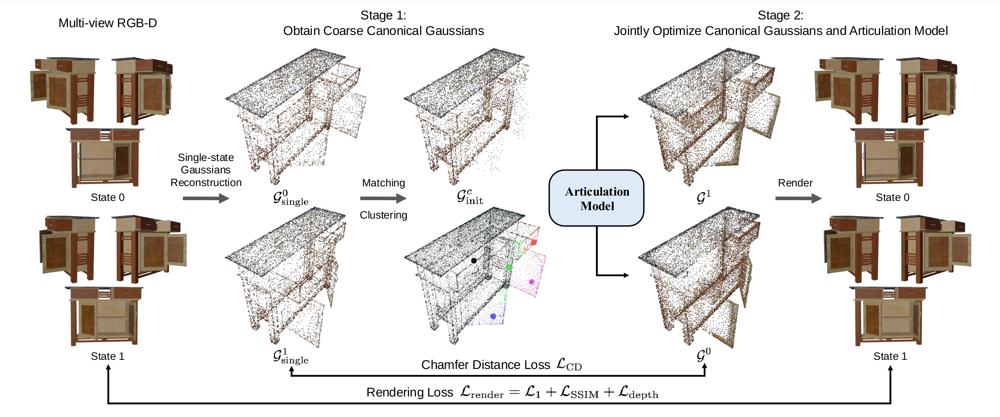

<div align="center">

# **ArtGS**: Building Interactable Replicas of Complex Articulated Objects via Gaussian Splatting
# ICLR 2025

<div align="center" margin-bottom="6em">
    <span class="author-block">
        <a href="https://yuliu-ly.github.io" target="_blank">Yu Liu✶</a><sup>1,2</sup>,</span>
    <span class="author-block">
        <a href="https://buzz-beater.github.io" target="_blank">Baoxiong Jia✶</a><sup>2</sup>,</span>
    <span class="author-block">
        <a href="https://github.com/Jason-aplp" target="_blank">Ruijie Lu</a><sup>2,3</sup>,</span>
    <span class="author-block">
        <a href="https://dali-jack.github.io/Junfeng-Ni" target="_blank">Junfeng Ni</a><sup>1,2</sup>,</span>
    <span class="author-block">
        <a href="https://zhusongchun.net" target="_blank">Song-Chun Zhu</a><sup>1,2,3</sup>,</span>
    <span class="author-block">
        <a href="https://siyuanhuang.com" target="_blank">Siyuan Huang</a><sup>2</sup></span>
    <br>
    <p style="font-size: 0.9em; padding: 0.5em 0;">✶ indicates equal contribution</p>
    <span class="author-block">
        <sup>1</sup>Tsinghua University &nbsp&nbsp 
        <sup>2</sup>National Key Lab of General AI, BIGAI &nbsp&nbsp 
        <sup>3</sup>Peking University
    </span>

[Website](https://articulate-gs.github.io/) | [Arxiv](https://arxiv.org/abs/2502.19459) | [Data](https://huggingface.co/datasets/YuLiu/ArtGS-Dataset)
</div>
</div>




## Reconstruct Interactable Replicas

<video controls>
  <source src="assets/videos/demo.mp4" type="video/mp4">
  Your browser does not support the video tag.
</video>


## Environment Setup
We provide all environment configurations in ``requirements.txt``. To install all packages, you can create a conda environment and install the packages as follows: 
```bash
git clone git@github.com:YuLiu-LY/ArtGS.git --recursive
cd ArtGS

conda create -n artgs python=3.10
conda activate artgs
conda install pytorch==2.4.1 torchvision==0.19.1 torchaudio==2.4.1 pytorch-cuda=12.1 -c pytorch -c nvidia
pip install -r requirements.txt

# install pytorch3d and tiny-cuda-nn
pip install git+https://github.com/facebookresearch/pytorch3d.git
pip install git+https://github.com/NVlabs/tiny-cuda-nn/#subdirectory=bindings/torch

# build pointnet_lib for nearest farthest point sampling
cd utils/pointnet_lib
python setup.py install
cd ../..

# a modified gaussian splatting (+ depth, alpha rendering)
pip install ./submodules/diff-gaussian-rasterization

# simple-knn
pip install ./submodules/simple-knn
```
In our experiments, we used NVIDIA CUDA 12.1 on Ubuntu 22.04. You may need to modify the installation command according to your CUDA version.

## Data Preparation 
Download the data from [GoogleDrive](https://drive.google.com/file/d/19EjgNX-vzXVpMagvroChZnaB4RhUVMG4/view?usp=sharing) or [HuggingFace](https://huggingface.co/datasets/YuLiu/ArtGS-Dataset).

## Training
We provide the following files and scripts for training:
 - ``train_coarse.py`` & ``scripts/coarse.sh`` : training the coarse single state Gaussians.
 - ``train_predict.py`` & ``scripts/predict.sh``: predicting the joint types.
 - ``train.py`` & ``scripts/train.sh``: training the full model.

Please run ``scripts/coarse.sh`` to build canonical Gaussian and ``scripts/predict.sh`` to predict joint types before running ``scripts/train.sh``.

## Evaluation
We provide ``render.py`` and script ``scripts/eval.sh`` for evaluation. You can download the checkpoints from [GoogleDrive](https://drive.google.com/file/d/19EjgNX-vzXVpMagvroChZnaB4RhUVMG4/view?usp=sharing) or [HuggingFace](https://huggingface.co/datasets/YuLiu/ArtGS-Dataset).
We also provide ``render_video.py`` and ``render.sh`` for rendering videos.


## Potential Improvements
We found the following tricks are useful for reconstructing self-captured real-world objects.

**Using Point Cloud.**

We provide ``data_tools/process_artgs.py`` for calculating the point cloud from the depths.
Use flag ``--init_from_pcd`` to train the coarse single state Gaussians with point cloud.

**Manually Correcting the Centers.**

Real-world multi-part objects may have occlusions caused by other objects or their parts. The occlusions may lead to significant differences between the two single-state Gaussians, making the Spectral Clustering fail to find suitable centers of parts. We can manually correct the centers of parts by visualizing the initialized canonical Gaussians and centers in ``vis_utils/vis_init_cano.ipynb``.

**Using Monocular Depth for Training.**

We tried to use monocular depth estimated by [DepthAnythingV2](https://github.com/DepthAnything/Depth-Anything-V2) to train the model, which slightly improves the performance. 

## Useful Tools
We provide some useful tools for visualization in ``vis_utils``.

``canonicalize_mesh.py`` can canonicalize the mesh and joint axes, rescaling objects and moving them to specific locations.

``demo_gen_glb.py`` can be used to generate dynamic meshes as GLB files in Blender.

``json2urdf`` can be used to convert json files and meshes reconstructed by artgs to URDF files.

``vis_artgs.ipynb`` can be used to visualize the optimized Gaussians, centers, part-segmentation and joint axes.

``vis_init_cano.ipynb`` can be used to visualize the initialized canonical Gaussians, centers, and part-segmentation.

``vis_camera.ipynb`` can be used to visualize the camera poses and meshes.

## Citation
If you find our paper and/or code helpful, please consider citing:
```
@inproceedings{liu2025building,
  title={Building Interactable Replicas of Complex Articulated Objects via Gaussian Splatting},
  author={Liu, Yu and Jia, Baoxiong and Lu, Ruijie and Ni, Junfeng and Zhu, Song-Chun and Huang, Siyuan},
  booktitle={The Thirteenth International Conference on Learning Representations},
  year={2025},
}
```

## Acknowledgement
This code heavily used resources from [SC-GS](https://github.com/yihua7/SC-GS), [BO-QSA](https://github.com/YuLiu-LY/BO-QSA), [DigitalTwinArt](https://github.com/NVlabs/DigitalTwinArt), [PARIS](https://github.com/3dlg-hcvc/paris), [reart](https://github.com/stevenlsw/reart), [lab4d](https://github.com/lab4d-org/lab4d). We thank the authors for open-sourcing their awesome projects.

